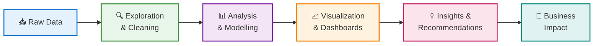

<div align="center">

# 👋 Hi, I'm Aditya Pandey

## 📊 Data Analyst | Business Analyst

**Raw Data. Clear Insights. Smart Decisions.**

---

### 🎯 Currently exploring Data Analyst & Business Analyst roles • Open to recruiters

[📧 Email](mailto:adityapandey12391@gmail.com) • [💼 LinkedIn](https://linkedin.com/in/aditya-pandey-analytics) • [💻 GitHub](https://github.com/aditya-pandey-data)

</div>

---

## 💼 About Me

I transform complex datasets into **actionable business insights** using SQL, Python, Tableau, and Power BI. My work spans the full analytics lifecycle—from data exploration and SQL analytics to predictive modelling and AI-powered reporting—helping organisations make confident, data-driven decisions.

---

## 📈 My Analytics Approach



---

## 🚀 What I Do

<details open>
<summary><strong>👇 Click to explore my core capabilities</strong></summary>

| Capability | What It Means |
|-----------|--------------|
| 📊 **Data Exploration & Analytics** | Uncover patterns, trends, and anomalies in complex datasets using SQL and Python |
| 🗄️ **SQL Solutions** | Design robust queries for reporting, KPI tracking, and data warehouse analytics |
| 📈 **Dashboard Design** | Create interactive, user-focused dashboards (Tableau, Power BI) that drive decision-making |
| 🤖 **Predictive Analytics** | Build ML models for forecasting, classification, and risk assessment |
| ⚡ **Automation** | Develop AI-powered workflows that reduce manual effort and accelerate insights |
| 💡 **Storytelling** | Translate complex findings into clear, actionable business recommendations |

</details>

---

## 🛠️ Technical Stack

<table align="center">
<tr>
<td width="20%"><strong>Languages</strong><br/>🐍 Python<br/>🗄️ SQL</td>
<td width="20%"><strong>Data Tools</strong><br/>🐼 Pandas<br/>🔢 NumPy<br/>📚 Scikit-learn</td>
<td width="20%"><strong>BI & Viz</strong><br/>📊 Tableau<br/>📈 Power BI<br/>🎨 Plotly</td>
<td width="20%"><strong>Platforms</strong><br/>⚙️ Streamlit<br/>💾 SQL DBs<br/>🤖 Groq API</td>
<td width="20%"><strong>Tools</strong><br/>📑 Excel<br/>🔗 Git<br/>📝 GitHub</td>
</tr>
</table>

---

## 📂 Featured Projects

All projects are hosted on **[GitHub](https://github.com/aditya-pandey-data)** with complete code, analysis, and documentation.

<table>
<tr>
<td width="50%">

### 💳 Credit Risk & Loan Default Prediction

**Predictive model** identifying high-risk borrowers across **32,409 applications**

**📊 Business Impact:**
- 💰 $47.4M projected annual loss reduction
- 🎯 Risk-based lending strategy
- 📉 Improved approval accuracy

**Stack:** Python • Scikit-learn • Tableau

[View Project →](https://github.com/aditya-pandey-data)

</td>
<td width="50%">

### 📉 Customer Churn Analysis

**Customer analytics solution** identifying churn drivers and revenue at risk

**📊 Business Impact:**
- 👥 High-value customer segmentation
- 📈 Revenue protection strategies
- 🎯 Targeted retention programs

**Stack:** SQL • Python • Tableau

[View Project →](https://github.com/aditya-pandey-data)

</td>
</tr>

<tr>
<td width="50%">

### 🤖 AI-Powered Business Report Generator

**Full-stack platform** transforming data → SQL insights → AI analysis → PDF reports

**📊 Business Impact:**
- ⚡ Automated end-to-end analysis
- 📄 Stakeholder-ready reports in seconds
- 🚀 Accelerated decision-making

**Stack:** Python • Streamlit • Groq API • SQLite • Plotly

[View Project →](https://github.com/aditya-pandey-data)

</td>
<td width="50%">

### 📊 Marketing Campaign Performance

**Campaign analysis** on **166,000+ records** to optimise spend and ROI

**📊 Business Impact:**
- 🎯 High-ROI segment identification
- 💵 Optimised budget allocation
- 📈 Campaign performance visibility

**Stack:** SQL • Python • Excel • Tableau

[View Project →](https://github.com/aditya-pandey-data)

</td>
</tr>

<tr>
<td colspan="2">

### 🏪 Retail Business & Inventory Analytics

**Retail analytics solution** evaluating sales, supplier efficiency, and inventory health

**📊 Business Impact:**
- 📦 Inventory optimisation strategy
- 🔄 Supplier performance insights
- 💼 Profitability improvements

**Stack:** SQL • Python • Tableau

[View Project →](https://github.com/aditya-pandey-data)

</td>
</tr>
</table>

---

## 📈 Analytical Expertise

<details open>
<summary><strong>📚 Methods & Domains</strong></summary>

**Statistical & Predictive Methods**
- Classification & Regression
- Time Series Forecasting
- Customer Segmentation
- Anomaly Detection
- Risk Modelling
- Causal Inference

**Business Analytics**
- Customer Analytics
- Financial Analytics
- Marketing Analytics
- Retail Operations
- Dashboard Development
- KPI Reporting

</details>

---

## 💡 Philosophy

> "Great analytics isn't just about analysing data—it's about asking the right questions, uncovering meaningful insights, and enabling smarter decisions that create measurable impact."

---

## 📊 Quick Stats

```
Projects Built:        5 end-to-end analytics solutions
Datasets Analysed:     500K+ records across domains
Models Deployed:       Predictive risk & churn models
Dashboards Created:    15+ interactive BI dashboards
Code Repositories:     github.com/aditya-pandey-data
```

---

<div align="center">

### ⭐ Found value in my work?

A star helps others discover these projects. Always open to data-driven collaboration and discussion.

**[Explore My Portfolio →](https://github.com/aditya-pandey-data)**

---

*Last updated: June 2026*

</div>
